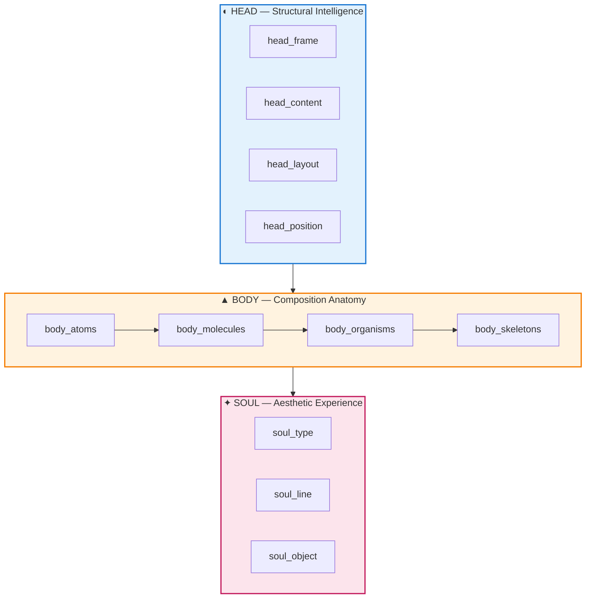
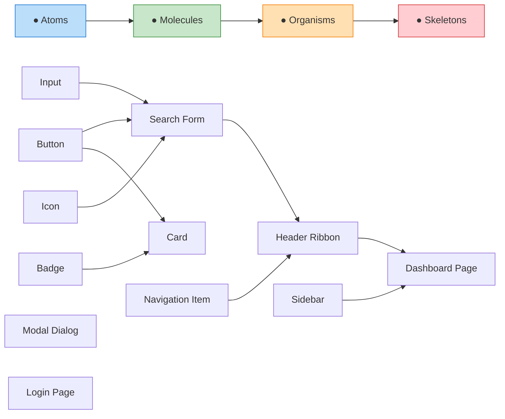
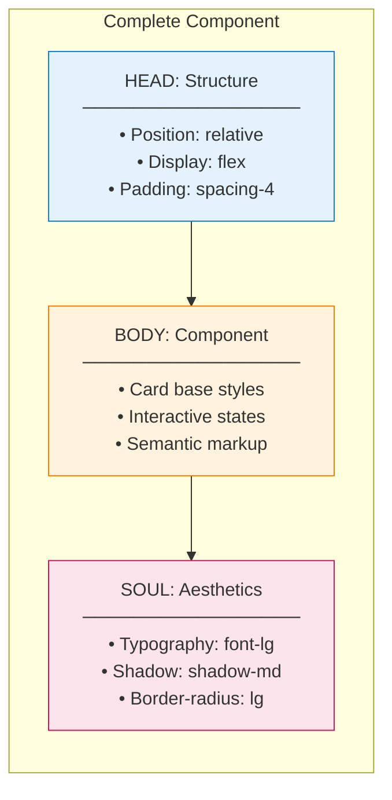
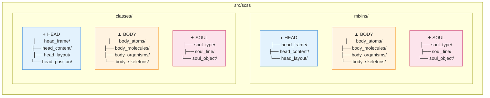

# Head Body Soul Architecture

StyleScape uses a unique **three-tier architectural pattern** called "Head Body
Soul" that organizes styles by their fundamental purpose. This philosophy draws
inspiration from human anatomy as a metaphor for design systems.

## Philosophy

Just as humans have distinct systems working together—a brain for thinking, a
body for action, and a soul for expression—StyleScape separates concerns into
three complementary tiers:

| Tier     | Metaphor             | Purpose                                                             |
| -------- | -------------------- | ------------------------------------------------------------------- |
| **Head** | ◐ The Brain         | Structural intelligence — layout, positioning, spatial organization |
| **Body** | ▲ The Physical Form | Composition anatomy — UI components following Atomic Design         |
| **Soul** | ✦ The Personality   | Aesthetic experience — typography, colors, shadows, motion          |

This separation ensures that **structure**, **components**, and **styling**
remain decoupled, making the system more maintainable, scalable, and
composable.

---

## Architecture Overview



---

## The Three Tiers

### ◐ HEAD — Structural Intelligence

The **Head** tier controls the skeleton of your application—how elements are
positioned, how space is distributed, and how the overall page structure is
organized.

> Think of HEAD as the architect's blueprint: it defines where things go, not
> what they look like.

#### Modules

| Module          | Description                  | Examples                                                 |
| --------------- | ---------------------------- | -------------------------------------------------------- |
| `head_frame`    | Application shell containers | `frame_main`, `frame_app`, `frame_canvas`, `frame_login` |
| `head_content`  | Content region structures    | `main_content`, `section`, `footer`, `sidebar_section`   |
| `head_layout`   | Layout utilities             | Grid, Flexbox, spacing, display, overflow, stacks        |
| `head_position` | Positioning utilities        | Fixed, sticky, absolute, z-index, order                  |

#### Directory Structure

```
head_frame/
├── _frame_main.scss      # Full-page 3×3 grid layout
├── _frame_app.scss       # Application wrapper
├── _frame_canvas.scss    # Canvas/viewport container
├── _frame_center.scss    # Centered content frame
└── _frame_login.scss     # Login page structure

head_layout/
├── display/              # Display properties
├── flex/                 # Flexbox utilities
├── grid/                 # CSS Grid utilities
├── spacing/              # Margin, padding, gap
├── position/             # Positioning mixins
├── overflow/             # Overflow handling
└── stacks/               # Vertical/horizontal stacks
```

#### Example Usage

```scss
// Using head_frame for page structure
@use "mixins/head_frame" as frame;

.app-shell {
    @include frame.frame_main;
}

.content-area {
    @include frame.frame_main__area--center;
}
```

---

### ▲ BODY — Composition Anatomy

The **Body** tier contains all UI components, organized following **Atomic
Design** methodology. Components are built from small, reusable pieces that
combine into increasingly complex structures.

> Think of BODY as the LEGO bricks: atoms snap together to form molecules,
> which combine into organisms, which compose skeletons.

#### Atomic Design Hierarchy



#### Modules

| Module           | Atomic Level | Description                                                         |
| ---------------- | ------------ | ------------------------------------------------------------------- |
| `body_atoms`     | Atoms        | Smallest building blocks — buttons, inputs, icons, badges, dividers |
| `body_molecules` | Molecules    | Composed components — cards, forms, dropdowns, accordions           |
| `body_organisms` | Organisms    | Complex sections — ribbons, sidebars, modals, galleries             |
| `body_skeletons` | Skeletons    | Page templates — complete page layouts                              |

#### Atoms (`body_atoms/`)

Basic UI elements that cannot be broken down further:

```
body_atoms/
├── buttons/          # Button, button_flipper, button_switch
├── inputs/           # Text, checkbox, radio, select, toggle, range
├── status/           # Progress, spinner, badge
├── display/          # Icon, divider, tooltip
├── layout/           # Box, spacer, dimensions
└── media/            # Image, video components
```

#### Molecules (`body_molecules/`)

Atoms combined to form functional groups:

```
body_molecules/
├── cards/            # Card components
├── forms/            # Form compositions, floating labels
├── navigation/       # Dropdown, pagination, breadcrumb
├── content/          # Accordion, chip, figure
├── feedback/         # Toast, popover
├── media/            # Carousel, slideshow
├── hero/             # Hero sections
└── table/            # Table components
```

#### Organisms (`body_organisms/`)

Complex components that form distinct sections:

```
body_organisms/
├── ribbon/           # Navigation header bar
├── sidebar/          # Sidebar navigation
├── modal/            # Modal dialogs
├── offcanvas/        # Off-canvas panels
├── gallery/          # Image galleries
├── widget/           # Widget containers
└── ticker/           # News/content tickers
```

#### Example Usage

```scss
@use "mixins/body_atoms" as atoms;
@use "mixins/body_molecules" as molecules;

.submit-btn {
    @include atoms.button;
    @include atoms.button--primary;
}

.product-card {
    @include molecules.card;
    @include molecules.card--hoverable;
}
```

---

### ✦ SOUL — Aesthetic Experience

The **Soul** tier defines the visual personality of your design—how things look
and feel. This includes typography, colors, borders, shadows, and motion.

> Think of SOUL as the artist's palette: it gives life and character to the
> structural body.

#### Modules

| Module        | Description       | Examples                                                   |
| ------------- | ----------------- | ---------------------------------------------------------- |
| `soul_type`   | Typography        | Font families, sizes, weights, text alignment, line height |
| `soul_line`   | Borders & Lines   | Border styles, widths, dividers, rules                     |
| `soul_object` | Visual Properties | Shadows, colors, fills, corners, sizing                    |

#### Directory Structure

```
soul_type/
├── font/             # font-family, font-size, font-weight
├── text/             # text-align, text-decoration, text-transform
├── character/        # letter-spacing, word-spacing
├── paragraph/        # Paragraph composition
└── list/             # List styling

soul_line/
├── _border_style.scss    # solid, dashed, dotted, double
├── _border_width.scss    # Border thickness
├── _border_side.scss     # Top, right, bottom, left
├── _rule.scss            # Horizontal rules
└── _vertical_rule.scss   # Vertical dividers

soul_object/
├── _style_shadow.scss    # Box shadows (sm, md, lg, xl)
├── _style_color.scss     # Color utilities
├── _style_fill.scss      # Background fills
├── _shape_corner.scss    # Border radius
└── _size.scss            # Width, height utilities
```

#### Example Usage

```scss
@use "mixins/soul_type" as type;
@use "mixins/soul_object" as object;

.heading {
    @include type.font-size--xl;
    @include type.font-weight--bold;
}

.card-elevated {
    @include object.shadow--lg;
    @include object.corner--md;
}
```

---

## How They Work Together

The three tiers are designed to be composed together:



### Practical Example: A Product Card

```scss
@use "mixins/head_layout" as layout;
@use "mixins/body_molecules" as molecules;
@use "mixins/soul_type" as type;
@use "mixins/soul_object" as object;

.product-card {
    // HEAD: Structure
    @include layout.flex--col;
    @include layout.gap--4;
    @include layout.padding--4;

    // BODY: Component behavior
    @include molecules.card;
    @include molecules.card--interactive;

    // SOUL: Visual styling
    @include object.shadow--sm;
    @include object.corner--lg;

    &__title {
        @include type.font-size--lg;
        @include type.font-weight--semibold;
    }

    &__price {
        @include type.font-size--xl;
        @include object.color--primary;
    }
}
```

---

## Complete Directory Map



---

## Design Principles

### 1. Separation of Concerns

Each tier has a single responsibility:

- **HEAD** answers: _"Where does it go?"_
- **BODY** answers: _"What is it?"_
- **SOUL** answers: _"How does it look?"_

### 2. Composability

Mixins from different tiers can be freely combined. A button can use HEAD for
its display properties, BODY for its component behavior, and SOUL for its
colors and shadows.

### 3. Progressive Complexity

The Atomic Design pattern within BODY ensures that complex components are built
from simpler, tested pieces. You never build an organism from scratch—you
compose it from atoms and molecules.

### 4. Dual Implementation

Both `mixins/` and `classes/` directories mirror the same structure:

- **Mixins** for SCSS composition and reuse
- **Classes** for direct HTML utility class usage

---

## Quick Reference

| Prefix             | Tier | When to Use                           |
| ------------------ | ---- | ------------------------------------- |
| `head_frame_*`     | Head | Full-page layouts, application shells |
| `head_content_*`   | Head | Content regions, sections             |
| `head_layout_*`    | Head | Flex, grid, spacing utilities         |
| `body_atoms_*`     | Body | Basic elements (buttons, inputs)      |
| `body_molecules_*` | Body | Composed elements (cards, forms)      |
| `body_organisms_*` | Body | Complex sections (modals, ribbons)    |
| `body_skeletons_*` | Body | Page templates                        |
| `soul_type_*`      | Soul | Typography                            |
| `soul_line_*`      | Soul | Borders, dividers                     |
| `soul_object_*`    | Soul | Shadows, colors, corners              |

---

## See Also

- [Structure](structure.md) — Visual diagram of the architecture
- [Naming Conventions](naming.md) — File and mixin naming patterns
- [Atoms](atoms.md) — Detailed atom reference
- [Quick Start](quick_start.md) — Getting started guide
