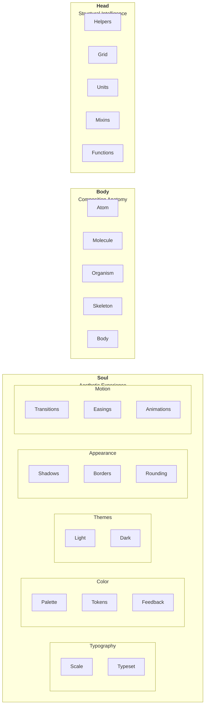

# Structure

Design atoms
The smallest building blocks in an atomic design system. These are typically single-purpose, reusable styles or components related to layout, typography, color, and interactivity.

⸻

🧬 Design Atoms

🎨 Color & Theme Tokens
 • --color-background
 • --color-foreground
 • --color-primary, --color-secondary, --color-accent
 • --color-success, --color-warning, --color-error, --color-info
 • --color-surface-1, --color-surface-2, --color-surface-3
 • --color-text-default, --color-text-muted, --color-text-inverse

🔤 Typography
 • font-family-*(e.g. sans, serif, mono)
 • font-size-* (e.g. xs, sm, md, lg, xl)
 • font-weight-*(100–900 or light–bold)
 • line-height-* (tight, normal, loose)
 • text-transform (uppercase, lowercase, capitalize)
 • letter-spacing, word-spacing

📐 Spacing & Sizing
 • padding-*, margin-*, gap-*
 • $q, $baseline (unit scales)
 • width-*, height-*, max-width, min-height
 • Grid and flex gap units

📏 Layout & Position
 • .container, .grid, .flex
 • display: block | inline | flex | grid
 • justify-*, align-*, place-*
 • position: relative | absolute | fixed
 • z-index: z('ribbon'), z('overlay'), etc.

UI Atoms
 • .button
 • .icon
 • .badge
 • .divider
 • .label
 • .checkbox, .radio, .input, .select

🌐 Interaction
 • cursor: pointer
 • hover:, focus:, active:, disabled: states
 • transition-*, animation-*
 • outline, box-shadow for focus states

Surface & Structure
 • .card, .panel, .elevation-*
 • border-*, border-radius-*
 • box-shadow-*, opacity-*

⸻

Would you like a downloadable visual index of these atoms or a SCSS structure to go with it?
